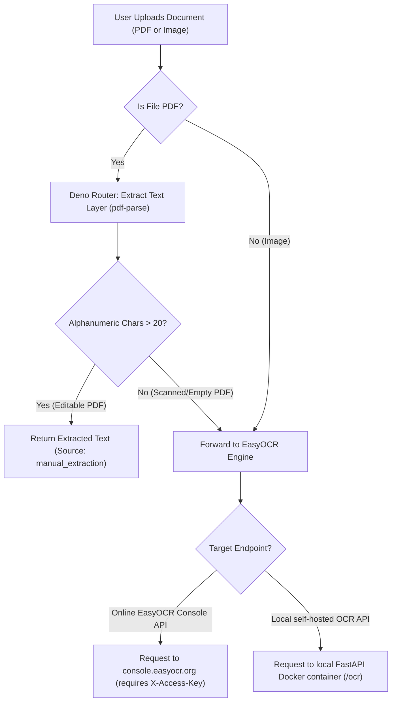

# OmniOCR — Hybrid Document & Text Router

OmniOCR is a high-performance, hybrid optical character recognition (OCR) and document text extraction system. It uses an intelligent routing mechanism to optimize speed, accuracy, and operational costs by dynamically separating digital (editable) documents from physical (scanned) media.

---

## System Architecture Overview

The system is split into three primary components:
1. **Frontend Dashboard**: A responsive, vanilla HTML/CSS/JS user interface for uploading files, monitoring queues, configuring settings, and reading extracted results.
2. **Deno Hybrid Router (Supabase Edge Function)**: The brains of the routing layer. It decides whether to extract text directly from the document file or route it to a full deep-learning OCR pipeline.
3. **Local EasyOCR Engine (FastAPI & Docker)**: A self-hosted Python service using deep learning (EasyOCR) to read images and rasterized PDF pages.



---

## Detailed Component Analysis

### 1. Deno Router (`supabase/functions/ocr-router/index.ts`)
The routing microservice is written in TypeScript and runs in Deno (configured for Deno 2 inside Supabase Edge Runtime).
* **Text Layer Extraction**: The router parses PDF binary buffers using `pdf-parse` (loaded from npm). If the document already contains a digital text layer (making it an editable PDF) and outputs more than 20 alphanumeric characters, Deno immediately responds with the text. This bypasses the need for resource-heavy image rendering or cloud API calls.
* **Fallback API Routing**: If the PDF is scanned (empty text layer) or the file is an image, the router packages the file as `multipart/form-data` and forwards it to the configured OCR endpoint (e.g. EasyOCR Console API).
* **Security & Keys Validation**: The router validates the incoming authentication tokens (like `EASYOCR_ACCESS_KEY`, `OCR_SPACE_KEY` or `OCR_API_KEY`) and prevents placeholder keys from propagating downstream.

### 2. Local EasyOCR Service (`easyocr_api/`)
A containerized Python backend designed for local offline OCR.
* **FastAPI Service**: Serves a `/ocr` POST endpoint, accepting files and language parameters.
* **Model Caching**: Reuses initialized `easyocr.Reader` instances by storing them in a Python dictionary keyed by language combination (e.g., `en`, `en,de`). This eliminates the heavy ~3–5 second latency of loading model weights on every request.
* **PDF Rasterization**: Converts incoming scanned PDFs into high-quality images page-by-page using `pdf2image` (which relies on `poppler-utils` in the OS level) before executing OCR.
* **GPU Acceleration**: Configurable via the `USE_GPU` environment variable (set in `docker-compose.yml`) to leverage CUDA cores if a compatible GPU is available.

### 3. Frontend Web Interface (`index.html`, `app.js`, `index.css`)
A sleek, modern glassmorphic dashboard built using CSS variables, custom grid layouts, and Vanilla JavaScript.
* **Queue Controller**: Handles multiple asynchronous file uploads, showing visual status badges (`pending`, `processing`, `success`, `failed`).
* **Settings Panel**: Allows users to dynamically change the endpoint (allowing fallback tests between local Deno, local Python Docker, and remote Supabase APIs) and manage access credentials.
* **Interactive Viewer**: Displays side-by-side metadata details, extraction sources (`manual_extraction` vs. `easyocr_api`), and formatted markdown/text results.

---

## Environment Configuration

The system uses configuration templates to secure API credentials:
* **`.env`**: Local environment file where you specify private keys, e.g., your EasyOCR Console/OCR Space key (`OCR_SPACE_KEY`). **This file is git-ignored to prevent security leaks.**
* **`example.env`**: A reference template showing the expected keys and configuration options without containing actual private values.

---

## Running the System Locally

To set up and run the entire local proof-of-concept:

### Step 1: Start the Local EasyOCR Engine
Ensure you have Docker and Docker Compose installed, then run:
```bash
docker-compose up --build -d
```
This builds the Python environment, downloads the default English OCR model, and hosts the API at `http://localhost:8000`.

### Step 2: Serve the Supabase Edge Function / Deno Router
Create a local `.env` file from the template:
```bash
cp example.env .env
# Edit .env and enter your key in OCR_SPACE_KEY
```

Run Deno locally to host the router:
```bash
PORT=54330 deno run --env --allow-net --allow-read --allow-env --allow-write --allow-sys supabase/functions/ocr-router/index.ts
```

### Step 3: Open the Web UI
Simply open `index.html` in your web browser. In the settings panel:
* Use `http://localhost:54330` to route traffic through the **Hybrid Router** (recommends direct text extraction for editable PDFs).
* Use `http://localhost:8000/ocr` to route traffic directly to the **Local EasyOCR Docker Container** (uses offline deep-learning OCR for all documents).
