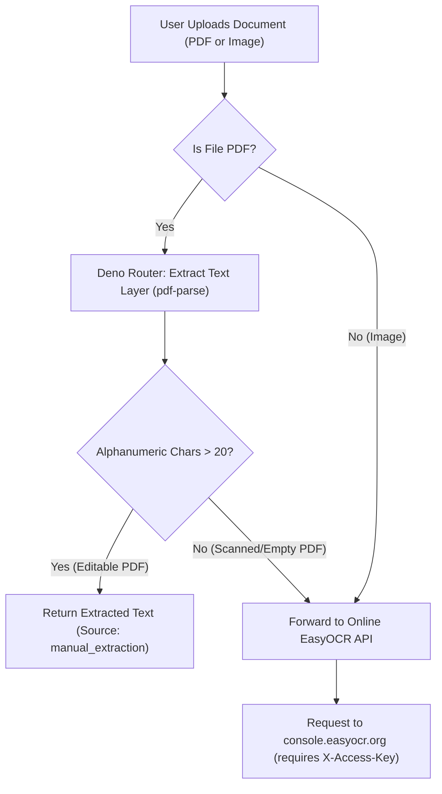

# OmniOCR — Hybrid Document & Text Router

OmniOCR is a high-performance, hybrid optical character recognition (OCR) and document text extraction system. It uses an intelligent routing mechanism to optimize speed, accuracy, and operational costs by dynamically separating digital (editable) documents from physical (scanned) media.

---

## System Architecture Overview

The system is split into two primary components:
1. **Frontend Dashboard**: A responsive, vanilla HTML/CSS/JS user interface for uploading files, monitoring queues, configuring settings, and reading extracted results.
2. **Deno Hybrid Router (Supabase Edge Function)**: The routing layer that decides whether to extract text directly from the document file or forward it to the online deep-learning OCR pipeline.



---

## Detailed Component Analysis

### 1. Deno Router (`supabase/functions/ocr-router/index.ts`)
The routing microservice is written in TypeScript and runs in Deno (configured for Deno 2 inside Supabase Edge Runtime).
* **Text Layer Extraction**: The router parses PDF binary buffers using `pdf-parse` (loaded from npm). If the document already contains a digital text layer (making it an editable PDF) and outputs more than 20 alphanumeric characters, Deno immediately responds with the text. This bypasses the need for resource-heavy image rendering or cloud API calls.
* **Online API Routing**: If the PDF is scanned (empty text layer) or the file is an image, the router packages the file as `multipart/form-data` and forwards it to the online EasyOCR Console API.
* **Security & Keys Validation**: The router validates the incoming authentication token (`EASYOCR_ACCESS_KEY` or `OCR_SPACE_KEY`) and prevents placeholder keys from propagating downstream.
* **Constraint Handling**: Enforces the 5MB file size limit, 30-second request timeout, and rate-limiting (429) checks according to the EasyOCR service documentation.

### 2. Frontend Web Interface (`index.html`, `app.js`, `index.css`)
A sleek, responsive, modern glassmorphic dashboard built using CSS variables, custom grid layouts, and Vanilla JavaScript.
* **Queue Controller**: Handles multiple asynchronous file uploads, showing visual status badges (`pending`, `processing`, `success`, `failed`).
* **Settings Panel**: Allows users to dynamically set the Edge Function endpoint and manage EasyOCR access credentials.
* **Interactive Viewer**: Displays side-by-side metadata details, extraction sources (`manual_extraction` vs. `easyocr_api`), and formatted text results.

---

## Environment Configuration

The system uses configuration templates to secure API credentials:
* **`.env`**: Local environment file where you specify private keys, e.g., your EasyOCR Console key (`OCR_SPACE_KEY` or `EASYOCR_ACCESS_KEY`). **This file is git-ignored to prevent security leaks.**
* **`example.env`**: A reference template showing the expected keys without containing actual private values.

---

## Running the System Locally

To set up and run the local proof-of-concept:

### Step 1: Serve the Supabase Edge Function / Deno Router
Create a local `.env` file from the template:
```bash
cp example.env .env
# Edit .env and enter your key in OCR_SPACE_KEY or EASYOCR_ACCESS_KEY
```

Run Deno locally to host the router:
```bash
PORT=54330 deno run --env --allow-net --allow-read --allow-env --allow-write --allow-sys supabase/functions/ocr-router/index.ts
```

### Step 2: Open the Web UI
Simply open `index.html` in your web browser. In the settings panel:
* Use `http://localhost:54330` to route traffic through the **Hybrid Router**.
* Input your EasyOCR Access Key to authenticate downstream requests.
